# 电路综合创新实践报告
[TOC]

## 1. 项目和理论模型

### 1.1 项目介绍
基于MLX90614的红外测温仪
基本实现功能：
1. 按下按键完成一次测温
2. 测温结果显示在LCD1602上

### 1.2 理论模型
为此计划搭建一个嵌入式系统，包括：
1. 处理器：***STC89C52RC***
2. 前向通道：红外传感器***MLX90614***
3. 通信通道：***I2C***
4. 人机交互：显示屏***LCD1602***、按键开关……
5. 后向通道：暂无


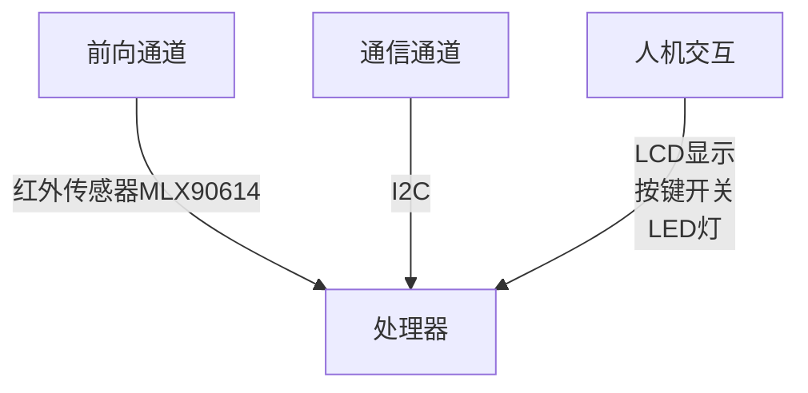
```mermaid
graph TD;
    A[处理器]
    B[前向通道] -->|红外传感器MLX90614| A
    D[通信通道] -->|I2C| A
    E[人机交互] -->|LCD显示<br>按键开关<br>LED灯| A
```

处理器通过I2C协议与红外传感器MLX90614通信，获取温度数据，进行计算处理，然后通过LCD1602显示出来。
## 2. 原理图设计
设计工具：嘉立创EDA
模块设计如下：
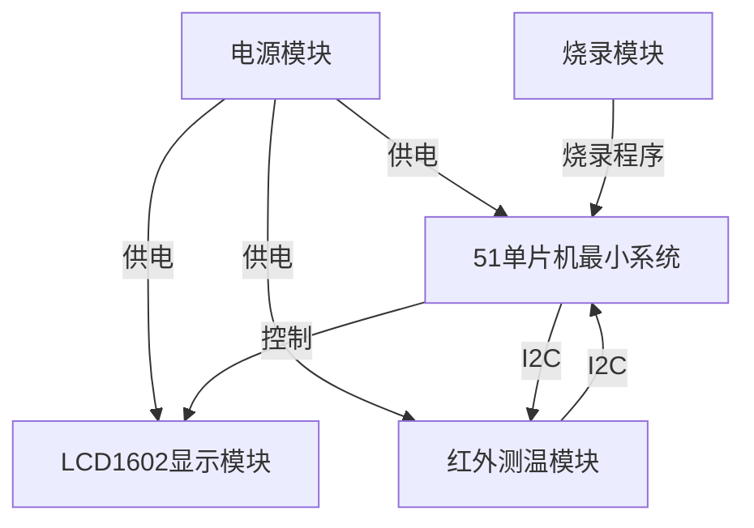
```mermaid
graph TD;
    A[51单片机最小系统]
    B[电源模块] --> |供电| A
    B[电源模块] --> |供电| C
    B[电源模块] --> |供电| D
    C[LCD1602显示模块]
    D[红外测温模块]
    E[烧录模块]
    A -->|控制| C
    A --> |I2C| D
    D --> |I2C| A
    E --> |烧录程序| A
```
根据上图所得到的模块结构和关系，设计原理图的步骤为：
1. 电源模块设计
2. 51单片机最小系统设计
3. LCD1602显示模块设计
4. 红外测温模块设计
5. 烧录模块设计
6. 原理图整合

### 2.1 电源模块设计
为方便设计和携带，电源模块设计为一个独立的模块，并且使用DC连接器连接9V电池，模块包括：
1. DC连接器
2. 自锁开关
3. 电源指示灯（LED）
4. 保护电阻
5. 去耦电容
6. 滤波电容
7. 稳压器

想要实现的效果是，当插入电池并按下自锁开关时，电源指示灯亮，表示电源正常；当松开开关时，电源指示灯熄灭，表示电源关闭。

并且为了给其他模块供电，需要将9V电压的电池电压降到5V，所以需要一个稳压器。这里采用的是LM7805稳压器，输入电压范围为7V-25V，输出电压为5V，最大输出电流为1A。

为了使输出电压更稳定，需要在输入端加上一个滤波电容和去耦电容，输出端加上一个去耦电容。

综合以上考虑，我所设计的电源模块的原理图如下：
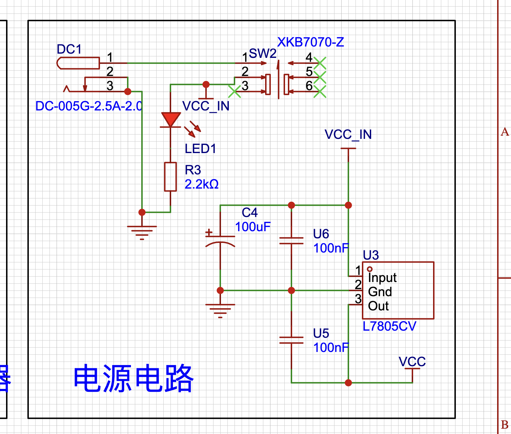
在这个电源电路中，三个电容分别是：

1. **C4 (100µF)**
   - **作用**: 这是一个滤波电容，用来对输入电压进行滤波，去除来自电源的低频纹波和噪声，提供更稳定的输入电压给稳压器。它主要针对电源中的低频纹波。

2. **U5 (100nF)**
   - **作用**: 这是一个去耦电容，放置在输入端。它的主要作用是过滤输入电压中的高频噪声，保护电路中的稳压器芯片和其他元器件，防止高频干扰影响电路的正常工作。

3. **U6 (100nF)**
   - **作用**: 同样是去耦电容，放置在输出端。它的作用是对稳压器输出的电压进行高频去耦，进一步抑制高频干扰，确保输出电压的稳定性，防止由于电源负载瞬态变化而引起的不稳定电压。

最后引出的5V电压通过接口引出，定义全局网络名VCC，供给其他模块使用。

### 2.2 51单片机最小系统设计
51单片机的最小系统是一个保证51单片机能够正常运行的最小硬件环境。

一个典型的51单片机最小系统包括以下几个部分：

1. 51单片机主芯片

	+ 主控芯片为STC89C52RC，整个系统的核心，用于执行程序和处理外部信号。

2. 电源电路

   + 51单片机通常需要5V的直流电源。通过稳压电路（7805稳压芯片）将外部高压电源(9V电池电压)转换成稳定的5V供电。

3. 复位电路

   + 复位电路用于在系统上电或出现问题时将单片机复位，包括一个按钮和一个上拉电阻。
     
   + 复位电路包括一个10kΩ的上拉电阻和一个10uF电容，与复位脚（RST）相连。

4. 晶振电路

	+ 51单片机需要一个外部晶振提供时钟信号，以保证其内部电路正常工作。本实验采用的是11.0592MHz的晶振，这是51单片机常用的晶振频率，并且也更方便配置波特率。
	+ 晶振电路还包括两个30pF的电容，分别与晶振的两个引脚相连，再接地。

5. 下载接口

	+ 51单片机会使用串口来下载程序。需要TXD和RXD引脚，实验采用CP2102芯片，将USB转串口，方便下载程序。

6. 引脚扩展接口

	+ 单片机最小系统设计时，把所有的I/O引脚引出，以便后续连接其他外围设备或模块，如LED、按键、蜂鸣器、显示屏等。

综合以上考虑，我所设计的51单片机最小系统的原理图如下：

* 主芯片

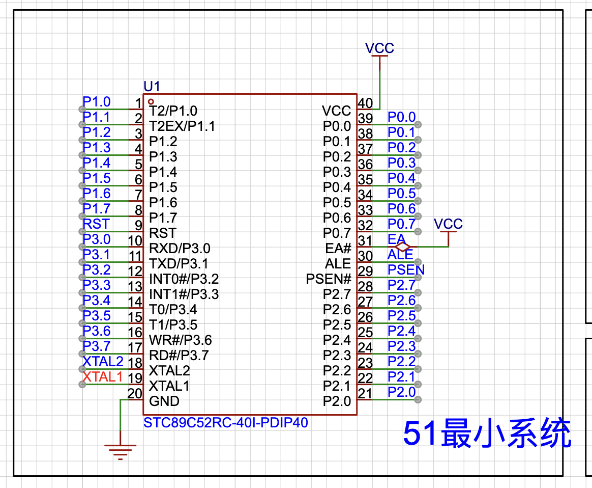

主芯片连接5V的VCC和对应的GND，同时EA接VCC，选择外部晶振，晶振的两个引脚分别连接到XTAL1和XTAL2，复位电路连接到RST，下载接口连接到P3.0和P3.1。

* 复位电路和晶振电路

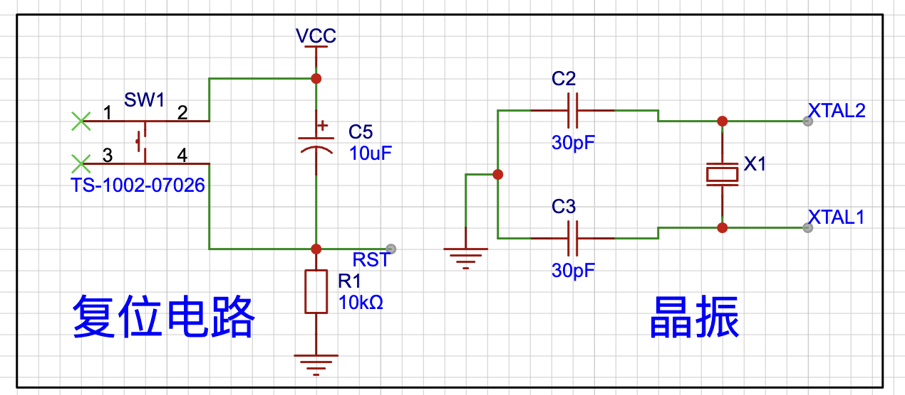

分别连接到RST和XTAL1、XTAL2。

* 接口

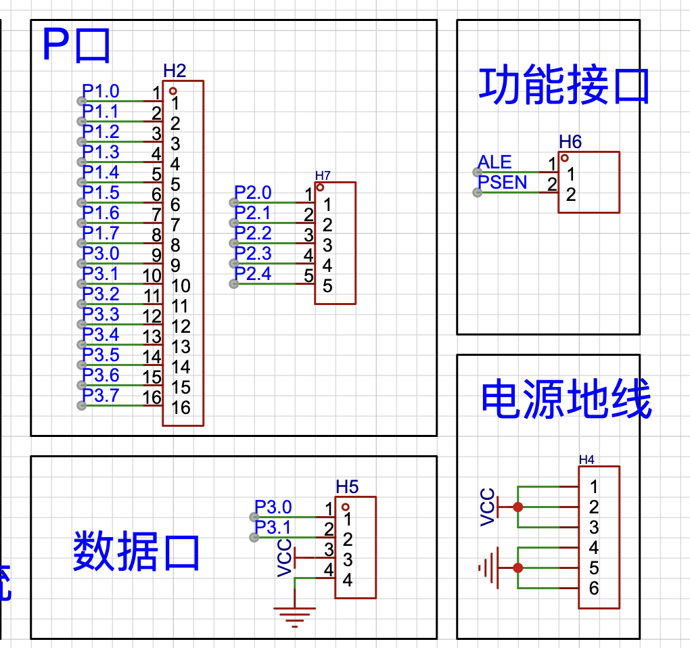

将所有的I/O引脚引出，方便后续连接其他外围设备或模块。

* P0口

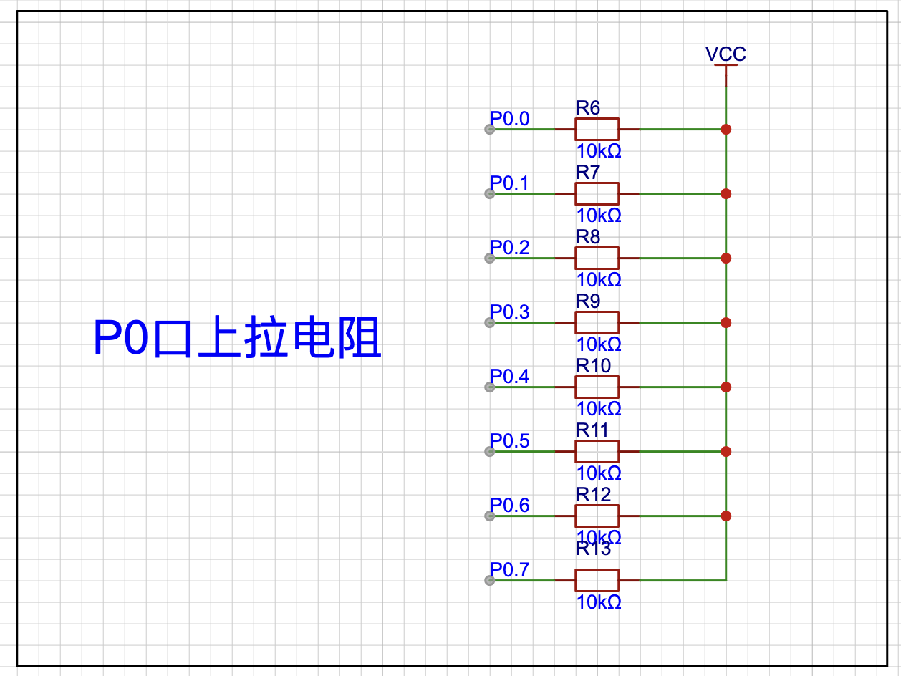

P0口是一个漏极开路的结构，决定了它只能主动输出低电平，高电平需要通过上拉电阻实现。同时，在数据/地址复用时，P0口需要上拉电阻来保证信号完整。

### 2.3 LCD1602显示模块设计
LCD1602显示模块是一个用于显示信息的模块，可以显示16×2个字符。
LCD1602的引脚的功能如下：
1. VSS：接地
2. VDD：+5V电源
3. V0：液晶对比度调节
4. RS：寄存器选择，高电平时数据，低电平时命令
5. RW：读写选择，高电平时读，低电平时写
6. E：使能端，高电平时有效
7. D0-D7：数据线
8. A：背光正极
9. K：背光负极
根据其引脚功能，设计LCD1602显示模块的原理图如下：

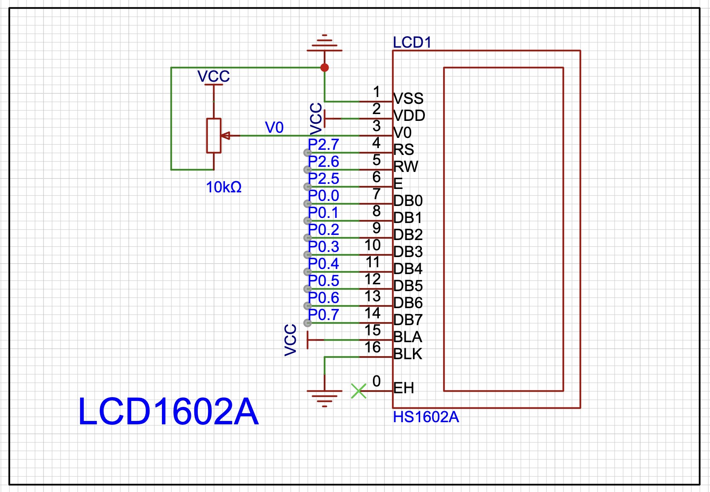

通过P0和P2口的数据线和控制线，与LCD1602连接，实现数据的显示。

P0口的数据线分别连接到D0-D7，控制线分别连接到RS、RW、E。

### 2.4 红外测温模块设计
红外测温模块是一个用于测量温度的模块，可以通过I2C协议与51单片机通信，获取温度数据。

使用的传感器是MLX90614，其引脚的功能如下：
1. SCL：I2C时钟线
2. SDA：I2C数据线
3. VDD：+5V电源
4. VSS：接地

根据其引脚功能，设计红外测温模块的原理图如下：

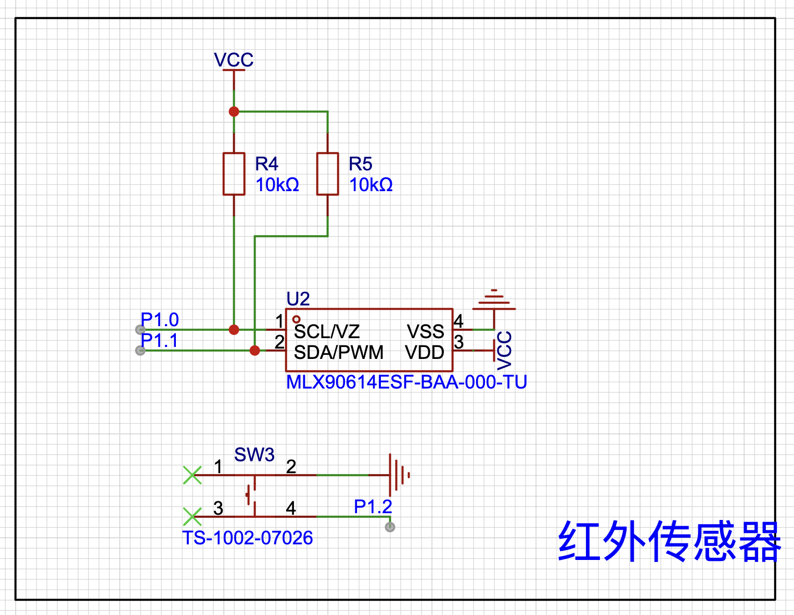

通过P1口连接SCL和SDA线，与MLX90614连接，实现数据的读取。

同时设计一个按键开关，使用轮询方式检测按键是否按下，按下时，51单片机向MLX90614发送命令，获取温度数据。

### 2.5 烧录模块设计
烧录模块采用了CP2102，USB转TTL。该模块由厂家生产，不需要我来单独设计。

在这里引出了51单片机的下载接口，方便烧录程序。P3.0和P3.1分别连接到TXD和RXD。

### 2.6 原理图整合
综合以上设计，我所设计的原理图如下：

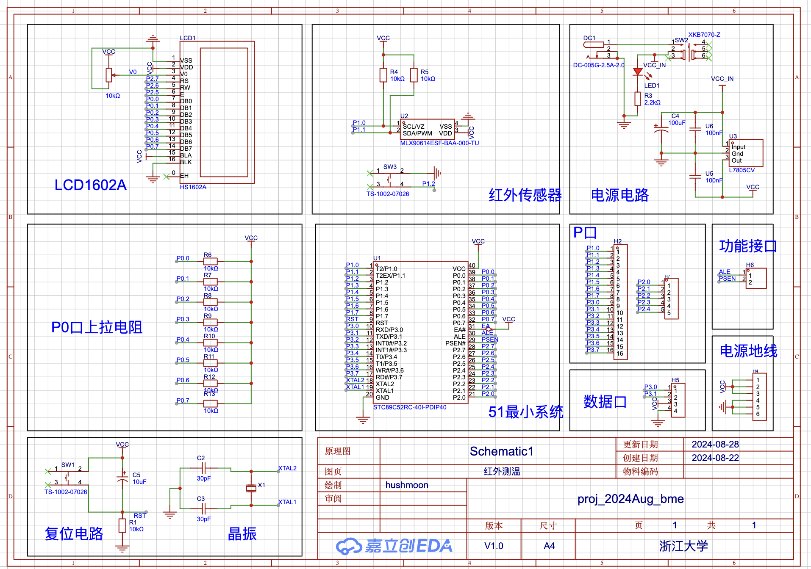

## 3. PCB设计
**设计工具：嘉立创EDA**
**PCB设计思路：**

```mermaid
graph LR;
    A[划分模块] --> B[模块布局] --> C[连线布局]
    C --> D[元件布局] --> E[走线] --> F[铺铜]
```
### 3.1 划分模块
使用嘉立创EDA，将原理图更新到PCB后，所有原件都会呈现在PCB图上，并且相应管脚有飞线连接。

我们可以通过在原理图上框选对应模块，按住**Ctrl+Shift+X**，即可选中PCB上对应的模块。

我们将这些原本杂乱无章的元件分模块划分，方便后续的布局。
实现的效果图如下所示：

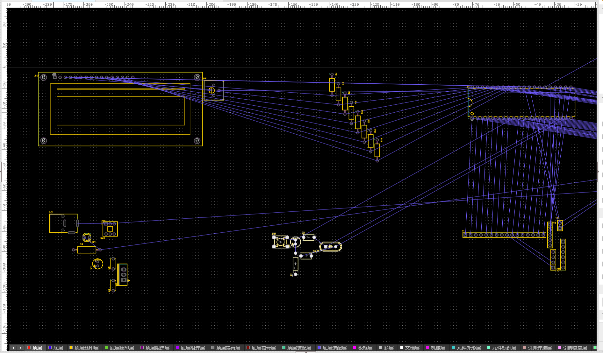

### 3.2 模块布局
确定PCB板的尺寸为100mm×100mm，然后将各个模块按照设计的原理图布局在PCB板上。

在布局时，大体需要考虑以下几个方面：
* 模块之间的距离：模块之间的距离不能太近，以免走线时出现交叉，影响电路的稳定性。模块之间的距离也不能太远，以免增加走线的长度，影响电路的稳定性。同时，像是晶振电路，需要尽量远离其他模块，并靠近主芯片，以减少时钟信号的干扰。
* 模块的摆放方向：模块的摆放方向要尽量统一，以便于走线。
* 模块与PCB板边缘的距离：模块与PCB板边缘的距离要保持一定的距离，一是避免元器件受机械应力、振动损害，二是减少外部干扰。
* 模块之间的连接：模块之间的连接要尽量简洁，避免交叉，以减少走线的长度，提高电路的稳定性。
* 人机交互：按键开关、LED灯等人机交互模块要尽量靠近PCB板的边缘，方便操作。

综合以上考虑，我所设计的模块布局如下：

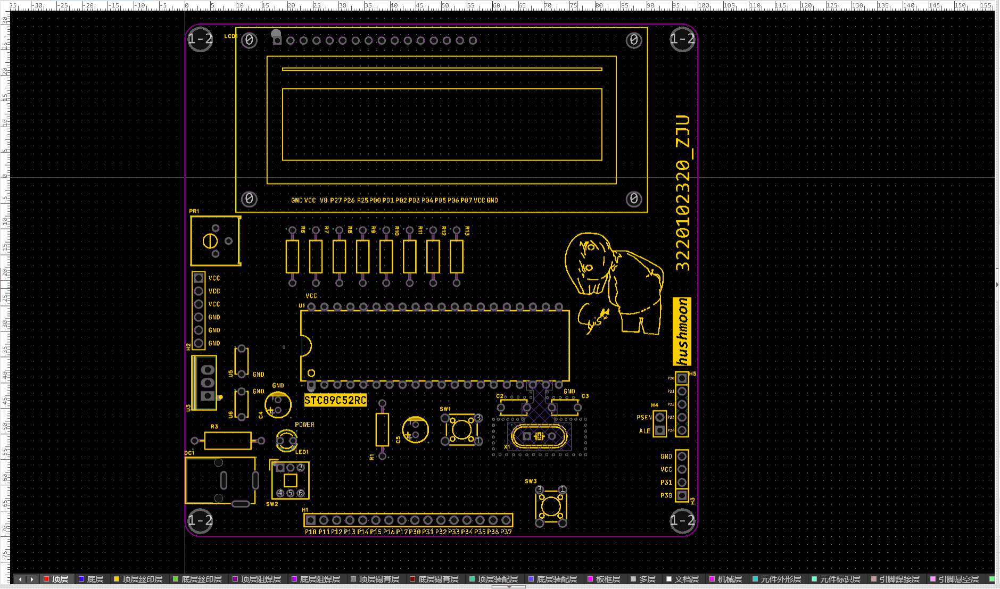

电源模块放在PCB板的一侧，方便接入电池。
开关、电位器等人机交互模块放在PCB板的边缘，方便操作。
LCD1602显示模块放在PCB板的另一侧，方便显示。
51单片机最小系统放在PCB板的中间，方便连接其他模块。
晶振电路靠近51单片机，远离其他模块，减少时钟信号的干扰。
排针放在PCB板的边缘，方便连接。

### 3.3 连线布局
在模块布局完成后，开始进行连线布局。
设计的PCB板是双层板，所以需要考虑走线的层数，尽量减少走线的层数，以减少走线的长度，提高电路的稳定性。
同时，还需要考虑走线的宽度，走线的宽度要根据走线的电流大小来确定，以保证走线的安全性。像是电源和地线，需要走较宽的走线，以减小电阻，提高电路的稳定性，我所采用的是40mil宽度。而信号线则可以走较窄的走线，以减小走线的长度，提高电路的稳定性，我所采用的是10mil宽度。
首先确定电源模块的连线布局。电源模块连接较为简单，但是VCC需要连接到其他模块，所以需要考虑VCC的走线。GND由于在之后的铺铜会将GND铺满，所以不需要考虑GND的走线。
> 这里助教给了建议是双面板一面铺铜GND，一面铺铜VCC，这样走线可以更加方便。我设计的是双面都是铺铜GND，因此VCC的走线会相对麻烦，这也是一个需要改进并且日后可以应用的地方。

51单片机的连线布局主要是P口连接排针排座，以及晶振电路的连线布局。晶振电路的连线布局需要尽量减少走线的长度，减少时钟信号的干扰。同时为了保证时钟信号的稳定性，晶振电路部分还增加了地线包围和禁止铺铜区域。
P口的走线我主要想放在顶层。但是P0口不仅需要接上拉电阻，还需要接排座来连接LCD1602显示模块，所以P0口的走线会比较复杂，我考虑上拉电阻的走线放在底层，LCD1602的走线放在顶层。P1口和P3口的走线相对简单，只需要连接到对应的排针即可。

### 3.4 元件布局
元件布局主要是在每个模块内部进行元件的布局，包括元件的旋转、移动、翻转等操作。
元件的走向要尽量统一，以便于走线。同时也要考虑到元件间的间距，和相互影响。
晶振部分，晶振要尽量与相连的两个30pF的电容靠近。
相邻的电容等走向也要尽量统一，不仅有利于电气性能，还可以让布局看起来更加的整齐。
电容靠近其相关联的器件进行布局，并保持电容与这些元件的连接方向一致，不仅能够减少寄生电感，还能提高滤波的效果。

### 3.5 走线
综合了以上连线布局和元件布局的考虑，开始进行走线。
* 走线的原则是尽量减少走线的长度，减少走线的层数，以提高电路的稳定性。
* 走线要尽量避免直角锐角走线。直角锐角的走线会导致信号反射、阻抗不连续、电磁干扰以及机械强度等各种问题，尽量采用45度拐角走线而非90度拐角，有效减少问题的发生。
* 宽度较窄的走线，为了提高其机械性能，还需要添加泪滴。
* 晶振电路还需要用到差分对，差分对的走线要尽量保持等长和对称，从而保持差分信号的对称性和平衡性。

实际我设计的走线如下所示，分别为顶层、底层和总体：

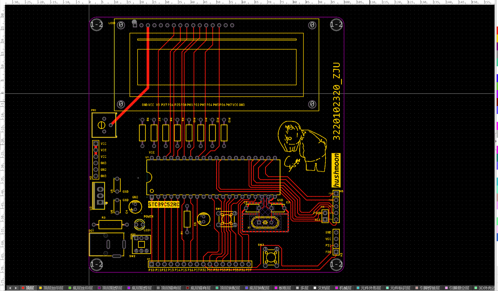

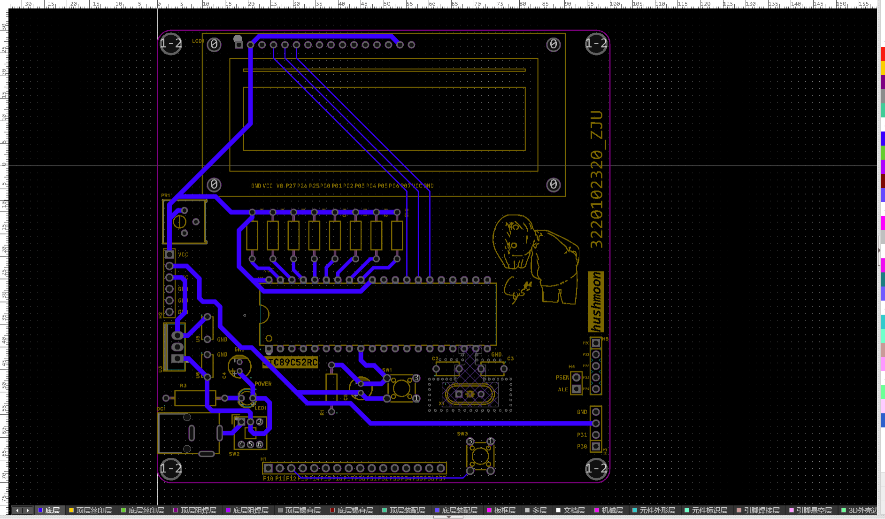

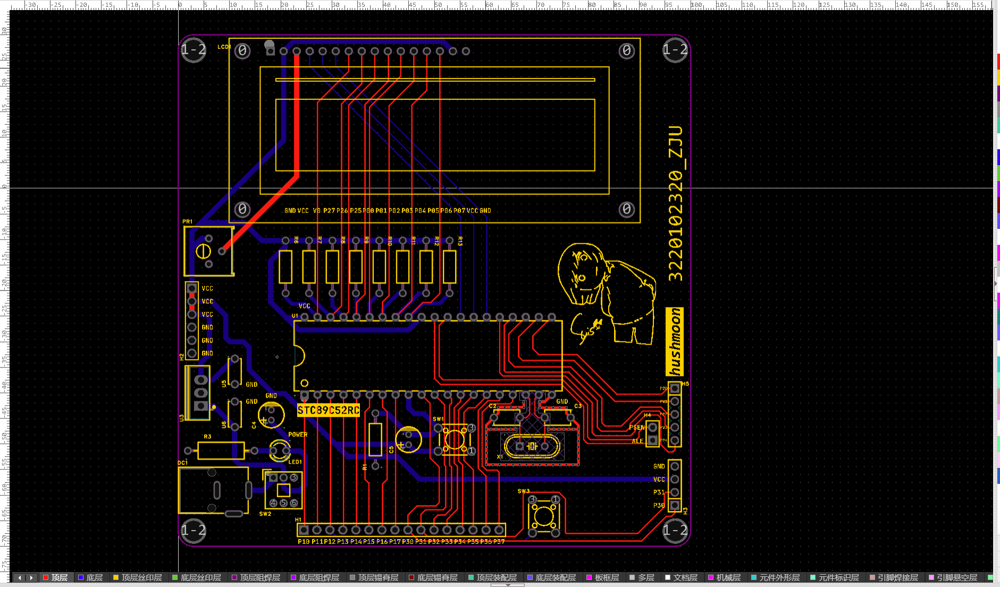

### 3.6 铺铜

进行DRC检查和电路原理的检查，确认没有问题后，进行铺铜。
嘉立创EDA的铺铜功能可以自动铺铜，操作非常简单。
分别进行顶层和底层的铺铜后，实现效果如下所示：

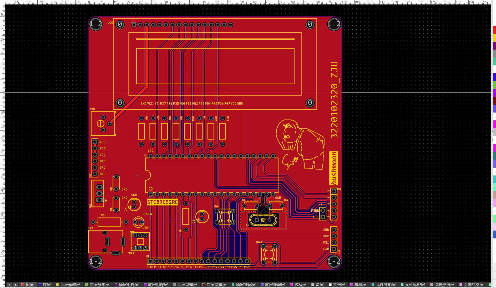

铺铜操作完成后，再进行DRC检查和自查，确认无误后，就可以进行导出Gerber文件，进行PCB板的生产。

## 4. 软件设计
软件设计部分我主要使用了***VSCODE*** 和 ***Keil5***。
程序的编写主要是在VSCODE上进行的，Keil5主要用于编译Project。
### 4.1 软件设计环境配置
#### 4.1.1 Keil5
Keil5是一款专业的嵌入式开发工具，可以用于51单片机的程序编写、编译、调试等。
**DOWNLOAD**：[Keil5](https://www.keil.com/download/product/)
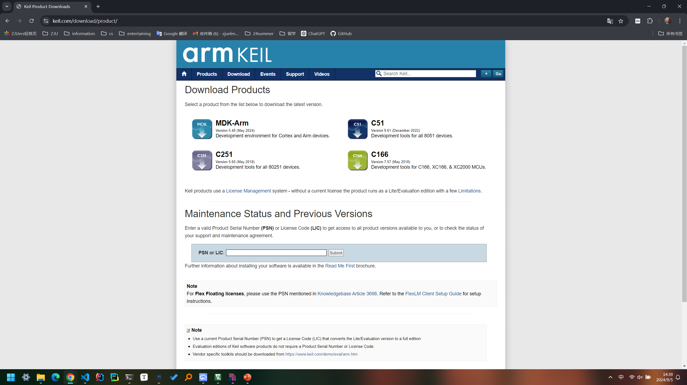

由于我们所使用的单片机型号是STC89C52RC，所以需要下载对应的芯片支持包，否则在Keil5中并没有我们所使用的芯片的型号，无法进行编译。

这里我们需要下载STC公司所提供的烧录软件——[STC-ISP](https://www.stcmicro.com/rjxz.html)。

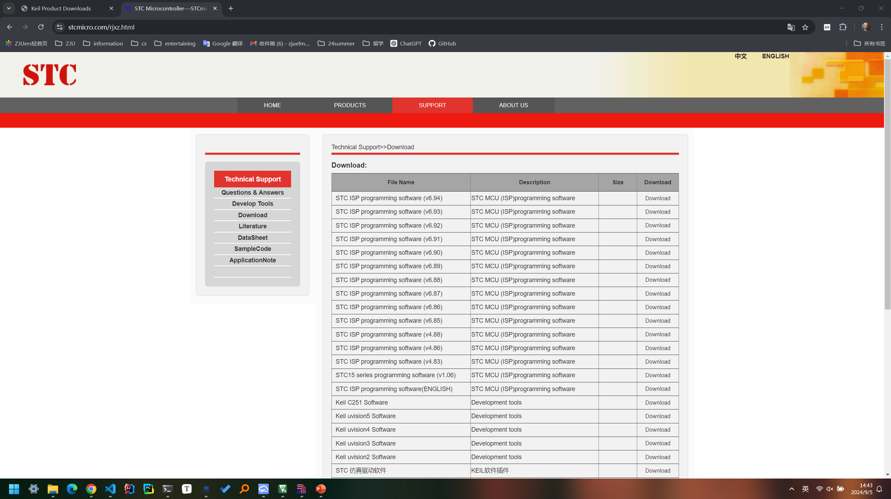

选择最新版本 STC ISP programming software (v6.94)下载即可。
成功下载后，我们打开STC-ISP，点开其中的Keil仿真设置，就可以将型号和头文件添加进入Keil5中。(Follow软件指定的流程即可)

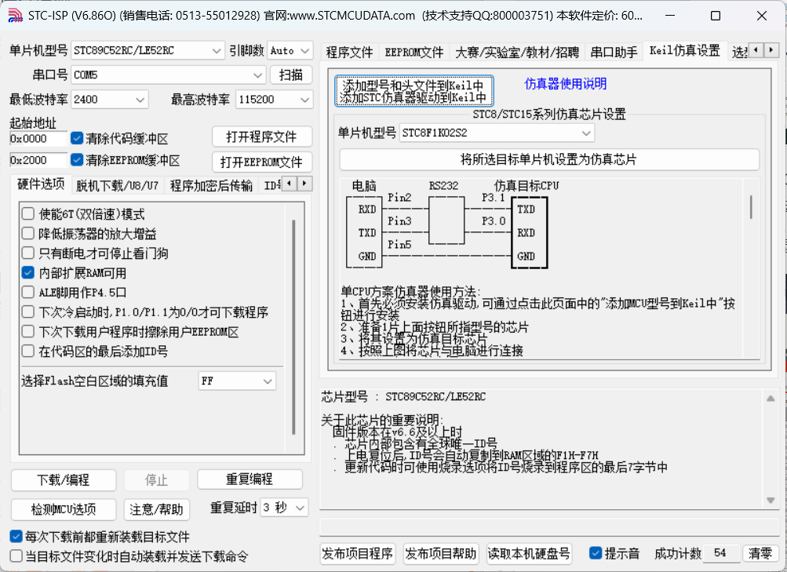

Keil软件的使用在此不赘述。

#### 4.1.2 VSCODE
VSCODE主要需要下载一个插件：Embedded IDE。
安装后，可以打开这样一个状态栏：


点击Configure Toolchain，选择Keil5的安装路径中的C51文件夹，即可完成配置。之后我们就可以像在keil5中一样编写代码，添加到source group文件夹中，具体的编译我并没有尝试过，而是直接使用Keil5进行编译。

> 使用VSCODE和Keil5都需要提前对C/C++的环境进行配置。

### 4.2 程序模块设计
程序模块设计主要是将原理图中的模块进行软件设计，实现相应的功能。
针对本课题需要实现的功能，我在这里主要分为四个模块：
1. ***main***：主函数模块，主要用于初始化各个模块，然后进入主循环。
2. ***MLX90614***：红外测温模块，主要用于与MLX90614红外传感器进行通信，获取温度数据。同时还包括了I2C模块的程序。
3. ***LCD1602***：LCD1602显示模块，主要用于与LCD1602显示屏进行通信，显示温度数据。
4. ***DELAY***： 主要是一些延时函数，用于延时。

为了项目结构的清晰，以及方便调试，我将这四个模块分别放在了不同的文件中，然后在main.c中进行调用，同时每个模块都有相应的头文件，方便调用。具体的Project结构如下所示：

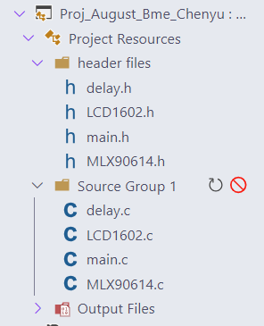

实现功能的流程图如下所示：

   ```mermaid
   flowchart TD
       A[START] --> B[Initialization] --> C{Switch Pressed?}
       C --> |Yes| D[Read Temperature] --> E[Display Temperature]
       C --> |No| C
       E --> C
   ```

#### 4.2.1 LCD1602
LCD1602显示模块主要是用于与LCD1602显示屏进行通信，显示温度数据。

LCD1602显示模块的Define如下：
```c
// PIN MAPPING
sbit RS  = P2 ^ 7;
sbit RW  = P2 ^ 6;
sbit EN  = P2 ^ 5;
sbit DB0 = P0 ^ 0;
sbit DB1 = P0 ^ 1;
sbit DB2 = P0 ^ 2;
sbit DB3 = P0 ^ 3;
sbit DB4 = P0 ^ 4;
sbit DB5 = P0 ^ 5;
sbit DB6 = P0 ^ 6;
sbit DB7 = P0 ^ 7;

#define uchar    unsigned char
#define uint     unsigned int
#define DataPort P0

#define CLR_RS   (RS = 0)
#define SET_RS   (RS = 1)
#define CLR_RW   (RW = 0)
#define SET_RW   (RW = 1)
#define CLR_EN   (EN = 0)
#define SET_EN   (EN = 1)
```
* ***Pin Mapping*** 主要是将LCD1602的引脚与单片机的引脚进行映射，方便后续的操作。包括RS、RW、EN、DB0-DB7，DataPort等。
* ***Define*** 主要是定义了一些常用的宏，方便后续的操作。包括CLR_RS、SET_RS、CLR_RW、SET_RW、CLR_EN、SET_EN等。

LCD1602显示模块的函数如下：
```c
// Functions
void LCD_Write_Command(uchar _cmd, uchar _check);
void LCD_Write_Data(uchar _dat);
void LCD_Init(void);
void LCD_Clear(void);
void WaitForEnable(void);
void LCD_LocateXY(uchar _X, uchar _Y);
void LCD_Display_Char(uchar _X, uchar _Y, uchar _char);                // display a single character
void LCD_Display_String(uchar x, uchar y, uchar *string);              // display a string
void LCD_Display_Number(uchar x, uchar y, uint _dat, uchar _len);      // display a single number
void LCD_Display_SignedNumber(uchar x, uchar y, int _dat, uchar _len); // display a signed number
```

最重要的是`void LCD_Write_Command(uchar _cmd, uchar _check);` `void LCD_Write_Data(uchar _dat);`两个函数。主要用于向LCD1602发送命令和数据。
其他的操作函数都是基于这两个函数进行的。
根据产品手册上的读写操作时序，我编写了相应的这两个函数。

```c
/*
    @author hushmoon
    Name: LCD_Write_Command
    Function: Write command to LCD1602
    Parameter:
        _cmd -- the command
        _check -- whether to wait for availability or not
    Additional Descriptions:
        RS = 0->LCD implement instructions
        RS = 1->LCD display data
        RW = 0->write data TO LCD
        RW = 1->read data FROM LCD
        EN: enable.only when there is a level jump from 0 to 1, can LCD update the data displayed
*/
void LCD_Write_Command(uchar _cmd, uchar _check)
{

    // waiting for availability
    if (_check) WaitForEnable();

    CLR_RS;
    CLR_RW;
    CLR_EN;
    LCD_Delay1ms();

    // prepare command in advance
    DataPort = _cmd;
    LCD_Delay1ms();

    // send level pulse
    SET_EN; // EN = 1
    LCD_Delay1ms();
    CLR_EN; // EN = 0
    LCD_Delay1ms();
}
```
这里需要注意的是RS、RW、EN的操作，以及DataPort的赋值。

* 当RS = 0，LCD处理指令；当RS = 1，LCD处理数据。
* 当RW = 0，写数据到LCD；当RW = 1，从LCD读数据。
* EN是使能端，只有在从0到1的跳变时，LCD才会更新显示。

值得注意的是，还需要有一个WaitForEnable函数，用于等待LCD的不忙。

```c
/*
    @author hushmoon
    Name: LCD_Write_Data
    Function: Write data to LCD1602
    Parameter: _dat -- the data
*/
void LCD_Write_Data(uchar _dat)
{
    // waiting for availability
    WaitForEnable();

    SET_RS;
    CLR_RW;
    CLR_EN;
    LCD_Delay1ms();

    // prepare data in advance
    DataPort = _dat;
    LCD_Delay1ms();

    // send level pulse
    SET_EN; // EN = 1
    LCD_Delay1ms();
    CLR_EN; // EN = 0
    LCD_Delay1ms();
}
```
这里的操作和LCD_Write_Command类似，只是RS = 1，表示LCD处理数据。

其他的函数主要是对这两个函数的封装，实现了对LCD1602的初始化、清屏、定位、显示字符、显示字符串、显示数字等操作。在此不再赘述，可以在代码中查看。

#### 4.2.2 MLX90614
MLX90614红外测温模块主要是用于与MLX90614红外传感器进行通信，获取温度数据。

MLX90614红外测温模块的头文件如下：
```c
#ifndef __MLX90614_H__
#define __MLX90614_H__

#include <REG52.H>
#include <INTRINS.H>
#include "delay.h"
#include "LCD1602.h"

#define uchar unsigned char
#define uint  unsigned int

sbit SCL = P1 ^ 0; // CLOCK stream
sbit SDA = P1 ^ 1; // DATA stream

// I2C MODULE
void I2C_Start(void);
void I2C_Stop(void);
void send_bit(void);
void send_byte(uchar _byte);
void receive_bit(void);
uchar receive_byte(void);
// MLX90614
uint Read_T(void);
int Convert_T(void);

#endif
```
SCL和SDA分别是I2C的时钟线和数据线，分别连接到了P1.0和P1.1。

MLX90614模块主要分为I2C通信部分和MLX90614温度获取部分。

I2C通信已经有了很多对应的编程范式，这里我直接使用了这些范式，只需要根据产品手册上的I2C通信时序，编写相应的函数即可。

```c
// I2C MODULE

/*
    @author hushmoon
    Name: I2C_Start
    Function: start bit
    Parameter: void
*/
void I2C_Start(void)
{
    SDA = 1;
    DelayUs2x(4);
    SCL = 1;
    DelayUs2x(4);
    SDA = 0;
    DelayUs2x(4);
    SCL = 0;
    DelayUs2x(4);
}

/*
    @author hushmoon
    Name: I2C_Stop
    Function: end bit
    Parameter: void
*/
void I2C_Stop(void)
{
    SCL = 0;
    DelayUs2x(4);
    SDA = 0;
    DelayUs2x(4);
    SCL = 1;
    DelayUs2x(4);
    SDA = 1;
    DelayUs2x(4);
}

/*
    @author hushmoon
    Name: send_bit
    Function: send one bit
    Parameter: void
*/
void send_bit(void)
{
    if (bit_out == 0)
        SDA = 0;
    else
        SDA = 1;
    DelayUs2x(1);
    SCL = 1;
    DelayUs2x(4);
    SCL = 0;
    DelayUs2x(4);
}

/*
    @author hushmoon
    Name: send_byte
    Function: send one byte
    Parameter: _byte -- the byte you wanna send
*/
void send_byte(uchar _byte)
{
    char i, dat;
    int retry_counter;
    dat           = _byte;
    retry_counter = 10;

    while (retry_counter > 0) {
        for (i = 0; i < 8; i++) {
            bit_out = (dat & 0x80) ? 1 : 0;
            send_bit();
            dat <<= 1;
        }
        receive_bit();
        if (bit_in == 0) {
            return;
        }
        I2C_Stop();
        I2C_Start();
        retry_counter--; // Decrement retry counter
        dat = _byte;     // Reset data for retransmission
    }
}

/*
    @author hushmoon
    Name: receive_bit
    Function: receive one bit
    Parameter: void
*/
void receive_bit(void)
{
    SDA    = 1;
    bit_in = 1;
    SCL    = 1;
    DelayUs2x(4);
    bit_in = SDA;
    DelayUs2x(2);
    SCL = 0;
    DelayUs2x(4);
}

/*
    @author hushmoon
    @return dat -- the byte you received
    Name: receive_byte
    Function: receive one byte
    Parameter: void
*/
uchar receive_byte(void)
{
    uchar i, dat;
    dat = 0;
    for (i = 0; i < 8; i++) {
        dat = dat << 1;
        receive_bit();
        if (bit_in == 1)
            dat = dat + 1;
    }
    send_bit(); // acknowledgement
    return dat;
}
```
分别是I2C的开始位、结束位、发送位、接收位、发送字节、接收字节。这里省略了一些细节，具体的可以查看代码。同时I2C通信部分我还省略了关于收发的ACK/NACK以及PEC的校验，因此这是一个精简版本的通信协议。

MLX90614温度获取部分主要是根据产品手册上的温度获取流程，编写相应的函数。

```c
/*
    @author hushmoon
    @return T -- the temperature you read but in kevin
    Name: Read_T
    Function: read temperature through mlx90614
    Parameter: void
*/
uint Read_T(void)
{
    I2C_Start();
    send_byte(0x00); // address
    send_byte(0x07); // command

    I2C_Start();
    send_byte(0x01);
    bit_out   = 0;
    Data_Low  = receive_byte();
    bit_out   = 0;
    Data_High = receive_byte();
    bit_out   = 1;
    PEC       = receive_byte();
    I2C_Stop();
    return (Data_High * 256 + Data_Low);
}

/*
    @author hushmoon
    @return T -- the temperature you read but in celsius
    Name: Convert_T
    Function: Convert the temperature from kelvin to celsius
    Parameter: void
*/
int Convert_T(void)
{
    int temp, T;
    temp = Read_T();
    T    = ((float)temp * 0.02f - 273.15f) * 100 * slope + intercept;
    return T;
}
```

MLX90614获取的温度一开始是开尔文温度，需要转换成摄氏度。

在Read_T部分，我们首先发送了0x00和0x07两个字节，然后接收了两个字节的数据，分别是Data_Low和Data_High，最后接收了一个字节的PEC (这个PEC并没有实际的用处，因为我把PEC计算和校验部分省去了) 。

要获得完整的温度数据，我们需要将Data_High和Data_Low合并，即`Data_High * 256 + Data_Low`，或者说是把Data_High左移8位，然后和Data_Low进行或运算。我们也可以写成`Data_High << 8 | Data_Low`。

而要将开尔文温度转换成摄氏度，我们需要使用公式：`T = ((float)temp * 0.02f - 273.15f) * 100 * slope + intercept`。这里的slope和intercept在后面的部分将会进行解释，这是对于MLX90614的一个校准。

#### 4.2.3 delay

delay部分的其中两个函数是简单的利用循环进行的延时，这里不再赘述。

值得一提的是利用定时器进行的延时函数，这里我使用了定时器T0，利用定时器的溢出中断进行延时。

```c
/*
    @author hushmoon
    Name: DelayMs
    Function: Delay for ms
    Parameter: ms -- the total ms you wanna delay
*/
void DelayMs(unsigned int ms)
{
    unsigned int i;
    for (i = 0; i < ms; i++) {
        // set the timer mode 1 (16-bits timer)
        // eliminate low 4 bits and set the mode to mode 1
        TMOD &= 0xF0;
        // timer 0 mode 1
        TMOD |= 0x01;

        // set the initial value
        TH0 = 0xFC;
        TL0 = 0x66;

        // start the timer
        TR0 = 1;

        // waiting for overflow
        while (TF0 == 0);

        // shut down the timer
        TR0 = 0;
        // clear the flag
        TF0 = 0;
    }
}
```
使用定时器进行延时的好处是可以进行多任务处理，不会阻塞主程序的运行，并且通过定时器初值的计算，也可以更加精准地进行延时。

#### 4.2.4 main

main函数主要是用于初始化各个模块，然后进入主循环。包括了主页面的显示，温度的显示以及按键的轮询。

```c
#include <REG52.H>
#include "delay.h"
#include "LCD1602.h"
#include "MLX90614.h"
#include "main.h"

int Temp; // temperature

sbit SW = P1 ^ 2; // switch

/*
    @author hushmoon
    Name: Display_Main
    Function: Display the main interface
    Parameter: void
*/
void Display_Main(void)
{
    LCD_Clear();
    LCD_Display_String(0, 0, "Temp:    .   C");
    LCD_Display_Char(12, 0, 0xDF);
}

/*
    @author hushmoon
    Name: Get_Temperature
    Function: Get the temperature and display it
    Parameter: void
*/
void Get_Temperature(void)
{
    LCD_Display_Char(5, 0, ' ');
    LCD_Display_Char(6, 0, Temp / 10000 % 10 + 0x30); // the hundreds
    LCD_Display_Char(7, 0, Temp / 1000 % 10 + 0x30);  // the tens
    LCD_Display_Char(8, 0, Temp / 100 % 10 + 0x30);   // the units
    LCD_Display_Char(10, 0, Temp / 10 % 10 + 0x30);   // the decimal
    LCD_Display_Char(11, 0, Temp % 10 + 0x30);        // the fractional
}

void main(void)
{
    int i;
    long Temp_sum;
    DelayMs(100);   // waiting for the chip to be ready
    LCD_Init();     // initialize the LCD
    Display_Main(); // display the main interface
    while (1) {
        if (SW == 0) {   // if the switch is pressed
            DelayMs(20); // debounce
            if (SW == 0) {
                Temp_sum = 0;

                for (i = 0; i < 256; i++) {
                    Temp_sum += Convert_T();
                    DelayMs(1);
                }

                Temp = Temp_sum / 256;
                Get_Temperature(); // get the temperature and display it
            }
        }
        while (SW == 0); // waiting for the switch to be released
        DelayMs(20);
    }
}
```
* `Display_Main` 函数主要是用于显示主页面，显示温度的地方是一个空格，会由 `Get_Temperature` 函数进行填充。 `LCD_Display_Char(12, 0, 0xDF);` 是用于显示摄氏度符号。
* `Get_Temperature` 函数主要是用于获取温度并显示。这里的温度是一个整数，需要进行分割，然后显示。
* `sbit SW = P1 ^ 2; // switch` 是一个按键开关，用于触发温度的获取和显示。程序采用轮询的方式检测按键。当按下SW时，首先进行了一个去抖动的延时，然后进行了256次的温度获取，最后取平均值，然后显示。

### 4.3 程序编译
程序编译主要是使用Keil5进行编译，编译成功后，会生成一个hex文件，用于烧录。但是使用Keil5进行编译需要有其他的一些设置。

* 需要设置正确的芯片型号，这里使用的是STC89C52RC。
* 需要设置正确的晶振频率，这里使用的是11.0592MHz。
* 需要设置生成hex文件。

首先我们需要打开Project，右键Target1，选择Options for Target 'Target 1'。

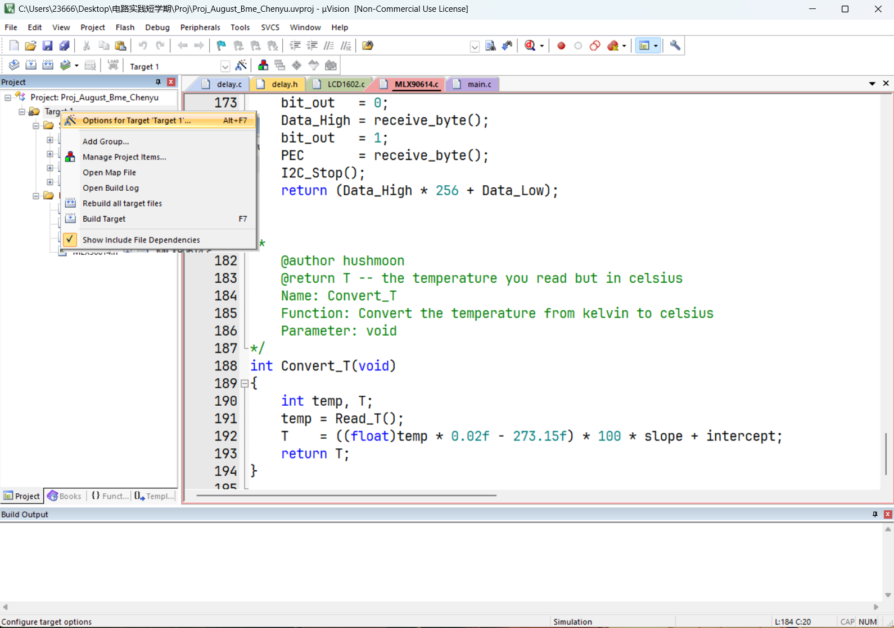

接着打开Device，选择正确的芯片型号。

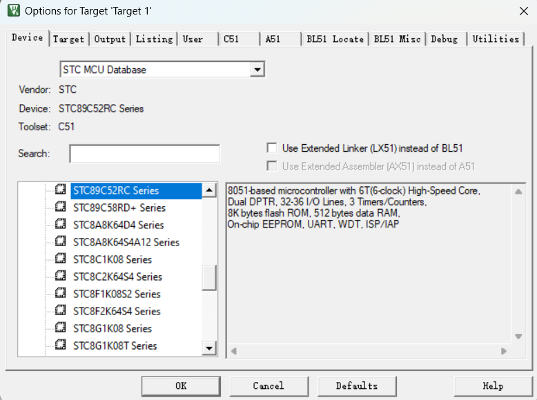

然后打开C51，选择正确的晶振频率。

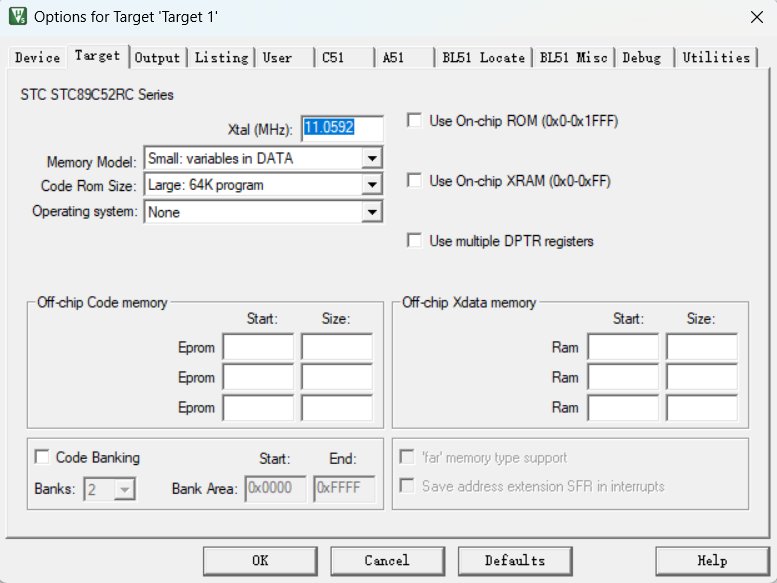

最后打开Output，选择生成hex文件。

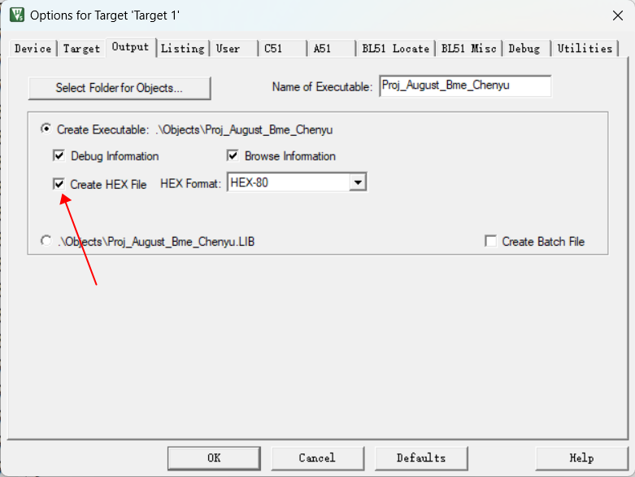

现在我们就可以进行编译了 （前提是代码已经检查无误）。

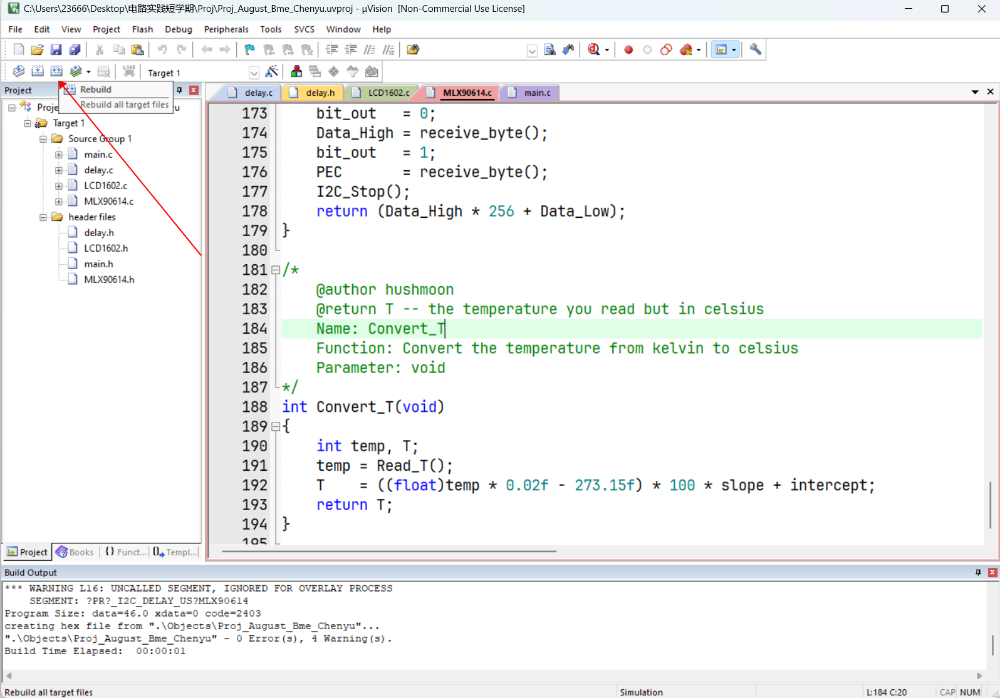

 显示成功编译，并且生成了一个hex file到我的Objects文件夹中。
 我们就可以使用STC-ISP进行烧录了。
## 5. 测试与调试
测试与调试主要是先进行投板、焊接，然后进行电路的调试，最后进行程序的调试。

### 5.1 投板、焊接
通过导出的Gerber文件投板后，得到的成品如下：


然后进行焊接，焊接完成后的成品以及相连接的模块如下：


这一部分主要是检查焊接是否有问题，是否有短路，是否有断路等。
并且焊接的先后顺序是一个非常重要的问题，一般来说，先焊接低矮的元件，再焊接高的元件，这样可以避免高的元件挡住低的元件，方便焊接。
我在焊接过程中没有充分考虑高矮问题，导致了一些焊接不够顺利，这是一个需要改进的地方。
同时焊接好一部分后需要进行电路的检查，比如焊接好电源模块后，先按下自锁开关，看看LED是否亮起，检查电源模块是否正常工作。并使用万用表检查电路电压是否正常，稳压器是否正常工作，输出电压是否稳定在5V。

### 5.2 电路调试

全部焊接完成后，进行整机电路调试，打开电源开关，检查电路是否正常工作，是否有异常，LCD1602是否正常显示。由于我所设计的电路比较简单，没有过多的交互模块，所以电路调试比较顺利，没有出现什么问题。

同时还需要用万用表测量电路的电压，电流等参数，检查是否符合设计要求，尤其是STC89C52RC各个管脚上的电压，来判断单片机是否正常工作。

### 5.3 程序调试

在程序调试之前，需要先将hex文件烧录到单片机中。这里我使用了STC-ISP进行烧录。但是我烧录的过程遇到了很多问题。

我使用的烧录器是CP2102，USB转TTL的烧录器。

1. **问题**：我将烧录器连接上单片机和笔记本USB端口后，发现设备管理器中并没有出现对应的串口，只有一个未知设备。
   **原因**：发现是驱动并没有安装。
   **解决方法**：前往烧录器生产厂家官网下载对应的驱动，安装后设备管理器中就会出现对应的串口。
2. **问题**：安装驱动后，设备管理器中仍然未出现相应的串口，仍显示未识别。
   **原因**：发现是我的烧录器发生故障，无法使用
   **解决方法**：更换了另一个烧录器，问题解决。
3. **问题**：烧录软件STC-ISP下载程序，显示无法识别单片机。
   **原因**：发现是STC89C52RC烧录需要冷启动。
   **解决方法**：先不打开电源，点击下载开始检测单片机后，再打开电源，即可识别单片机。
4. **问题**：解决冷启动问题后仍然无法正常下载程序。
   **原因**：发现是RXD和TXD脚接错了，需要烧录器的RXD接单片机的TXD，烧录器的TXD接单片机的RXD。
   **解决方法**：更改连接方式，问题解决。

烧录完成后，进行程序调试了。

程序的调试非常顺利，没有出现什么问题。主要是检查按键是否正常，温度是否正常，LCD1602是否正常显示。遇到的仅有的问题是：

* **问题**：LCD1602显示不正常，成功烧录后，显示屏什么都看不见。
* **原因**：发现是LCD1602的V0即对比度设置不到位。
* **解决方法**：旋转电位器调节对比度，问题解决。

最后显示效果如下所示：


## 6. 实践过程中的问题

除了以上章节中提及的问题像是编译问题、烧录问题等等，实践过程中还遇到了一个问题，这里进行详细阐述。
### 6.1 问题来源
第一次验收的时候，老师提出了我的温度测量有问题，显示的温度不准确。我的红外测温仪测量我和老师的额头温度时，都是35度多，且显示的数据相当不稳定，这对一个测量人体温度的产品来说，显然是不及格的，老师希望我改进测量精度问题。

### 6.2 问题分析 Part1
由于每一次按键测得的温度都相当不稳定，我怀疑是红外测温仪受环境因素影响较大，并且单次按键只进行了一次快速测温，就把这个温度显示了，显然不稳定因素是很大的。并且还有电路本身的噪声，我也并没有进行非常严格的滤波、去耦等处理，整个电路也没有进行封装和排除电磁干扰的手段，造成测温不稳定也是非常合理的。

### 6.3 解决方案 Part1
由于时间和现实因素设置，没有这个条件进行重新的硬件设计、元器件选择、封装，因此在硬件层面上，我无法进行更多的改进。于是我选择从软件上进行改进，使用了最简单的办法，即多次测量取平均值的方法，来提高测量的准确性。

在一次按键消抖检测到按键按下后，我进行了256次的温度测量，然后取平均值，这样可以有效地减少测量的误差，提高测量的准确性。

具体的代码实现：
```c
void main(void)
{
    int i;
    long Temp_sum;
    DelayMs(100);   // waiting for the chip to be ready
    LCD_Init();     // initialize the LCD
    Display_Main(); // display the main interface
    while (1) {
        if (SW == 0) {   // if the switch is pressed
            DelayMs(20); // debounce
            if (SW == 0) {
                Temp_sum = 0;

                for (i = 0; i < 256; i++) {
                    Temp_sum += Convert_T();
                    DelayMs(1);
                }

                Temp = Temp_sum / 256;
                Get_Temperature(); // get the temperature and display it
            }
        }
        while (SW == 0); // waiting for the switch to be released
        DelayMs(20);
    }
}
```
### 6.4 问题分析 Part2
经过一顿操作后，我发现温度测量的稳定性确实有所提高，测量同一物体——我的额头的时候，温度基本上只有0.2~0.3摄氏度左右的偏移，这是一个非常大的改进。但是我发现，测量的温度和实际的温度还是有一定的偏移，这个偏移是一个固定值，而不是随机的，这让我怀疑是红外测温仪的校准问题。

### 6.5 解决方案 Part2
红外测温仪的校准问题，我无法通过对传感器的改进来解决，直接去改EEPROM中的数据过于冒险，因此我选择了在软件层面上进行校准。我发现，红外测温仪的温度和实际温度之间的偏移是近似于一个固定值，近似于一个线性的偏移，因此我想可以通过一个简单的线性拟合来进行校准。

### 6.6 最终方案
我选择使用实际的测温枪来进行校准。我在同一时刻，使用测温枪和我的红外测温仪对同一物体进行测温，然后记录下两者的温度，分别记录在data.excel文件中。然后我编写了python程序LinearRegression_Temp.py，用于进行线性回归，得到斜率和截距，然后将这两个值写入到程序中，用于校准。这两个数值就是之前提到的slope和intercept。

我使用了pandas和scipy两个库，用于数据处理和线性回归。

```python
from scipy import stats
import pandas as pd

file_path = 'data.xlsx'
df = pd.read_excel(file_path)

x_data = df.iloc[:, 0].values
y_data = df.iloc[:, 1].values

slope, intercept, r_value, p_value, std_err = stats.linregress(x_data, y_data)

print(f"LinearFittingFormula: y = {slope:.4f} * x + {intercept:.4f}")
print(x_data)
print(y_data)
```
执行程序后得到结果如下：

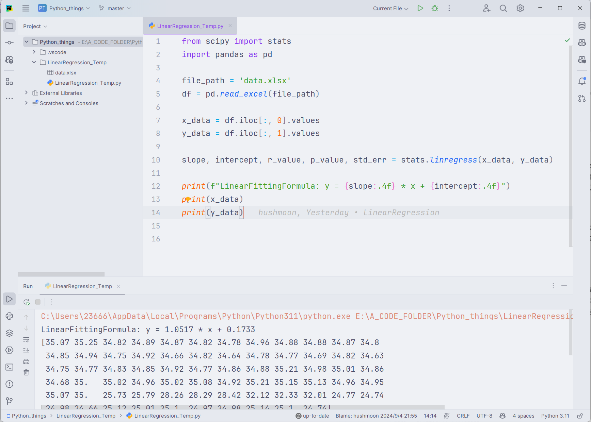

再将所得到的slope和intercept写入到程序中，重新编译，烧录，测试，发现温度测量的准确性得到了很大的提高，基本上和测温枪的测量结果一致。

尽管最后得到了非常不错的结果，仍然存在一些问题：

* 校准的数据量不够大，只有70组数据，这样的数据量是不够的，应该有更多的数据量来进行校准。
* 校准的方法也不够科学，只是简单的线性回归，这样的方法并不一定适用于所有的情况，应该有更多的方法来进行校准。
* 校准的测温枪也不一定准确。
* 电路的噪声也没有进行处理。
* 电路的封装和排除干扰也没有进行处理。
* 传感器本身的精度仍然可以提升，但是这个领域又是一个非常专业的领域了。
## 7. 总结

本次实践项目主要是实现一个简单的红外测温仪，需要我从零开始设计电路，设计PCB，投板焊接，编写程序，进行调试，最后得到一个完整的产品。项目本身并不复杂，我在两个多礼拜中完成整个项目获得的最大收获，一是了解了整个工作流程，二是对于嵌入式系统以及软硬件之间的联系有了更深的理解，三是考验了我的动手能力和发现、分析、解决问题的能力，四是让我思考未来的发展方向。
除去以上这些，我认为最最重要的是，在这个过程中，我感受到了pleasure。
***hushmoon***
***
