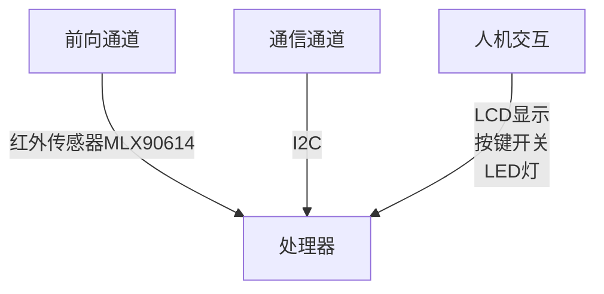
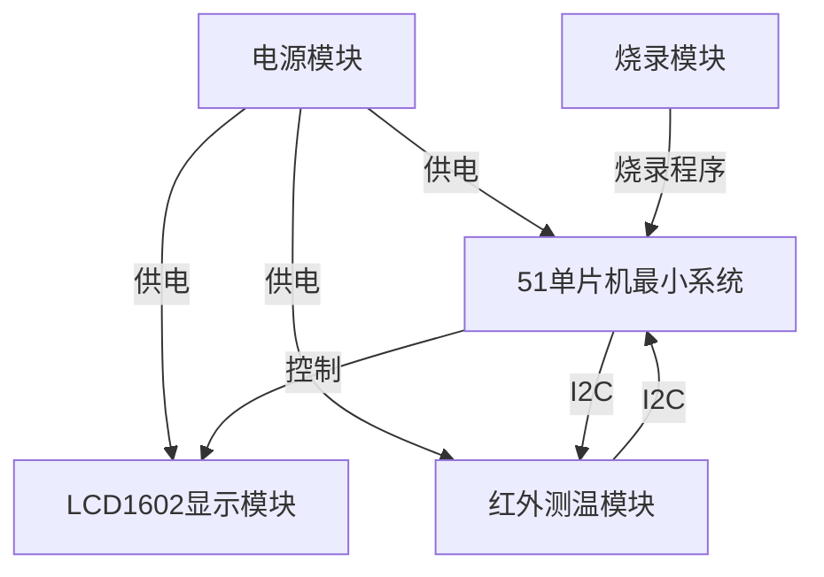

# 电路综合创新实践报告
[TOC]

## 1. 项目和理论模型

### 1.1 项目介绍
基于MLX90614的红外测温仪
基本实现功能：
1. 按下按键完成一次测温
2. 测温结果显示在LCD1602上

### 1.2 理论模型
为此计划搭建一个嵌入式系统，包括：
1. 处理器：***STC89C52RC***
2. 前向通道：红外传感器***MLX90614***
3. 通信通道：***I2C***
4. 人机交互：显示屏***LCD1602***、按键开关……
5. 后向通道：暂无

处理器通过I2C协议与红外传感器MLX90614通信，获取温度数据，进行计算处理，然后通过LCD1602显示出来。
## 2. 原理图设计
设计工具：嘉立创EDA
模块设计如下：

根据上图所得到的模块结构和关系，设计原理图的步骤为：
1. 电源模块设计
2. 51单片机最小系统设计
3. LCD1602显示模块设计
4. 红外测温模块设计
5. 烧录模块设计
6. 原理图整合

### 2.1 电源模块设计
为方便设计和携带，电源模块设计为一个独立的模块，并且使用DC连接器连接9V电池，模块包括：
1. DC连接器
2. 自锁开关
3. 电源指示灯（LED）
4. 保护电阻
5. 去耦电容
6. 滤波电容
7. 稳压器

想要实现的效果是，当插入电池并按下自锁开关时，电源指示灯亮，表示电源正常；当松开开关时，电源指示灯熄灭，表示电源关闭。

并且为了给其他模块供电，需要将9V电压的电池电压降到5V，所以需要一个稳压器。这里采用的是LM7805稳压器，输入电压范围为7V-25V，输出电压为5V，最大输出电流为1A。

为了使输出电压更稳定，需要在输入端加上一个滤波电容和去耦电容，输出端加上一个去耦电容。

综合以上考虑，我所设计的电源模块的原理图如下：

在这个电源电路中，三个电容分别是：

1. **C4 (100µF)**
   - **作用**: 这是一个滤波电容，用来对输入电压进行滤波，去除来自电源的低频纹波和噪声，提供更稳定的输入电压给稳压器。它主要针对电源中的低频纹波。

2. **U5 (100nF)**
   - **作用**: 这是一个去耦电容，放置在输入端。它的主要作用是过滤输入电压中的高频噪声，保护电路中的稳压器芯片和其他元器件，防止高频干扰影响电路的正常工作。

3. **U6 (100nF)**
   - **作用**: 同样是去耦电容，放置在输出端。它的作用是对稳压器输出的电压进行高频去耦，进一步抑制高频干扰，确保输出电压的稳定性，防止由于电源负载瞬态变化而引起的不稳定电压。

最后引出的5V电压通过接口引出，定义全局网络名VCC，供给其他模块使用。

### 2.2 51单片机最小系统设计
51单片机的最小系统是一个保证51单片机能够正常运行的最小硬件环境。

一个典型的51单片机最小系统包括以下几个部分：

1. 51单片机主芯片

	+ 主控芯片为STC89C52RC，整个系统的核心，用于执行程序和处理外部信号。

2. 电源电路

   + 51单片机通常需要5V的直流电源。通过稳压电路（7805稳压芯片）将外部高压电源(9V电池电压)转换成稳定的5V供电。

3. 复位电路

   + 复位电路用于在系统上电或出现问题时将单片机复位，包括一个按钮和一个上拉电阻。
     
   + 复位电路包括一个10kΩ的上拉电阻和一个10uF电容，与复位脚（RST）相连。

4. 晶振电路

	+ 51单片机需要一个外部晶振提供时钟信号，以保证其内部电路正常工作。本实验采用的是11.0592MHz的晶振，这是51单片机常用的晶振频率，并且也更方便配置波特率。
	+ 晶振电路还包括两个30pF的电容，分别与晶振的两个引脚相连，再接地。

5. 下载接口

	+ 51单片机会使用串口来下载程序。需要TXD和RXD引脚，实验采用CP2102芯片，将USB转串口，方便下载程序。

6. 引脚扩展接口

	+ 单片机最小系统设计时，把所有的I/O引脚引出，以便后续连接其他外围设备或模块，如LED、按键、蜂鸣器、显示屏等。

综合以上考虑，我所设计的51单片机最小系统的原理图如下：
* 主芯片

主芯片连接5V的VCC和对应的GND，同时EA接VCC，选择外部晶振，晶振的两个引脚分别连接到XTAL1和XTAL2，复位电路连接到RST，下载接口连接到P3.0和P3.1。

* 复位电路和晶振电路

分别连接到RST和XTAL1、XTAL2。

* 接口

将所有的I/O引脚引出，方便后续连接其他外围设备或模块。

* P0口

P0口是一个漏极开路的结构，决定了它只能主动输出低电平，高电平需要通过上拉电阻实现。同时，在数据/地址复用时，P0口需要上拉电阻来保证信号完整。

### 2.3 LCD1602显示模块设计
LCD1602显示模块是一个用于显示信息的模块，可以显示16×2个字符。
LCD1602的引脚的功能如下：
1. VSS：接地
2. VDD：+5V电源
3. V0：液晶对比度调节
4. RS：寄存器选择，高电平时数据，低电平时命令
5. RW：读写选择，高电平时读，低电平时写
6. E：使能端，高电平时有效
7. D0-D7：数据线
8. A：背光正极
9. K：背光负极
根据其引脚功能，设计LCD1602显示模块的原理图如下：

通过P0和P2口的数据线和控制线，与LCD1602连接，实现数据的显示。

P0口的数据线分别连接到D0-D7，控制线分别连接到RS、RW、E。

### 2.4 红外测温模块设计
红外测温模块是一个用于测量温度的模块，可以通过I2C协议与51单片机通信，获取温度数据。

使用的传感器是MLX90614，其引脚的功能如下：
1. SCL：I2C时钟线
2. SDA：I2C数据线
3. VDD：+5V电源
4. VSS：接地

根据其引脚功能，设计红外测温模块的原理图如下：

通过P1口连接SCL和SDA线，与MLX90614连接，实现数据的读取。

同时设计一个按键开关，使用轮询方式检测按键是否按下，按下时，51单片机向MLX90614发送命令，获取温度数据。

### 2.5 烧录模块设计
烧录模块采用了CP2102，USB转TTL。该模块由厂家生产，不需要我来单独设计。

在这里引出了51单片机的下载接口，方便烧录程序。P3.0和P3.1分别连接到TXD和RXD。

### 2.6 原理图整合
综合以上设计，我所设计的原理图如下：

## 3. PCB设计
**设计工具：嘉立创EDA**

## 4. 单片机程序设计
## 5. 测试与调试
## 6. 设计过程中的问题
## 7. 总结