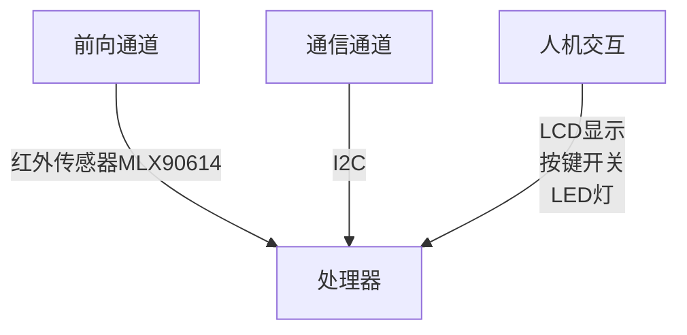

# 电路综合创新实践报告

[toc]

## 1. 项目和理论模型

### 1.1 项目介绍
基于MLX90614的红外测温仪
基本实现功能：
1. 按下按键完成一次测温
2. 测温结果显示在LCD1602上

### 1.2 理论模型
为此计划搭建一个嵌入式系统，包括：
1. 处理器：***STC89C52RC***
2. 前向通道：红外传感器***MLX90614***
3. 通信通道：***I2C***
4. 人机交互：显示屏***LCD1602***、按键开关……
5. 后向通道：暂无

处理器通过I2C协议与红外传感器MLX90614通信，获取温度数据，进行计算处理，然后通过LCD1602显示出来。
## 2. 原理图设计
## 3. PCB设计
## 4. 单片机程序设计
## 5. 测试与调试
## 6. 设计过程中的问题
## 7. 总结